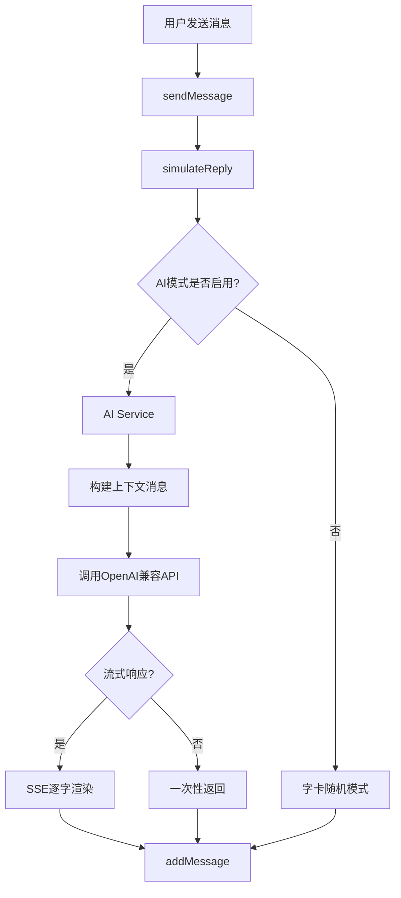

## 产品概述

在"传讯"聊天模拟应用中，原有的回复机制是从用户手动维护的"字卡"（自定义回复库）中随机抽取内容，无法根据对话上下文生成合理回复。需要新增AI接口集成，使应用能够调用大语言模型生成符合对话上下文的智能回复，同时保留原有的字卡回复模式作为备选。

## 核心功能

- **AI接口配置**：用户可填入API地址、API Key、选择模型，兼容OpenAI协议（`/v1/chat/completions`）
- **预设模型提供商**：内置DeepSeek、Mimo（MiniMax）、GLM（智谱AI）的API地址和模型名，用户一键选择即可使用
- **角色设定**：用户可自定义系统提示词（System Prompt），设定AI扮演的角色人设、说话风格等
- **上下文对话**：AI回复时自动携带最近聊天记录作为上下文，实现连贯对话
- **模式切换**：支持"AI模式"和"字卡模式"独立切换，AI模式优先，字卡模式作为降级方案
- **流式输出**：AI回复支持SSE流式显示，模拟"正在输入"的真实感
- **配置持久化**：AI相关设置通过localforage与现有设置系统一起存储

## 技术栈

- **前端框架**：纯HTML/CSS/JS（与现有项目一致）
- **API协议**：OpenAI Chat Completions API兼容协议
- **存储**：localforage（现有项目已在使用）
- **依赖**：无新增外部依赖，使用原生`fetch` API调用

## 技术方案

### 系统架构



### 实现策略

**AI服务模块** (`js/ai-service.js`)：

- 封装OpenAI兼容API调用逻辑
- 支持普通请求和SSE流式请求
- 构建系统提示词（包含角色设定 + 对方名字）
- 提取最近N条聊天记录作为上下文
- 错误处理和超时控制（30秒超时）

**simulateReply改造** (修改 `js/core.js`)：

- 在现有 `simulateReply()` 开头增加AI模式判断
- AI模式下：调用AI服务获取回复，SSE流式渲染到聊天界面
- AI失败时：自动降级到现有字卡模式
- 保留原有的partnerPersonas切换、拍一拍等概率事件

**设置系统扩展** (修改 `js/core.js` 的 `getDefaultSettings()`)：

- 新增 `aiEnabled`: 是否启用AI模式
- 新增 `aiApiUrl`: API地址
- 新增 `aiApiKey`: API密钥
- 新增 `aiModel`: 模型名称
- 新增 `aiSystemPrompt`: 角色设定/系统提示词
- 新增 `aiMaxContextMessages`: 上下文消息条数（默认20）
- 新增 `aiMaxTokens`: 最大生成token数（默认512）
- 新增 `aiTemperature`: 生成温度（默认0.8）

**预设提供商配置**：

```javascript
const AI_PRESETS = {
  deepseek: {
    name: 'DeepSeek',
    apiUrl: 'https://api.deepseek.com/v1/chat/completions',
    model: 'deepseek-chat',
    icon: '🔮'
  },
  mimo: {
    name: 'Mimo (MiniMax)',
    apiUrl: 'https://api.minimax.chat/v1/text/chatcompletion_v2',
    model: 'MiniMax-Text-01',
    icon: '🤖'
  },
  glm: {
    name: 'GLM (智谱)',
    apiUrl: 'https://open.bigmodel.cn/api/paas/v4/chat/completions',
    model: 'glm-4-flash',
    icon: '✨'
  }
};
```

### 实现细节

**上下文构建逻辑**：

- 取最近 `aiMaxContextMessages` 条消息
- 系统消息格式：`[角色设定] + 你是[partnerName]，正在和[myName]聊天`
- 用户/助手消息映射：`sender='user'` -> `role='user'`，其他 -> `role='assistant'`
- 图片消息跳过（纯文本上下文）

**SSE流式渲染**：

- 使用 `fetch` + `ReadableStream` 解析SSE
- 创建一个临时消息气泡，逐字更新内容
- 流结束后将最终内容作为正式消息添加
- 复用现有的 `addMessage()` 和打字指示器UI

**错误处理**：

- 网络错误：显示通知并降级到字卡模式
- API错误（401/429/500）：显示具体错误信息
- 超时（30秒）：中止请求并降级
- 空回复：降级到字卡模式

**性能考虑**：

- API调用为异步操作，不阻塞UI
- 使用AbortController支持请求取消
- 上下文消息限制条数，避免token溢出
- API Key存储在localStorage中，不传输到第三方

### 关键修改文件

1. **`js/ai-service.js`** [新增] - AI服务核心模块
2. **`js/core.js`** [修改] - `simulateReply()` 增加AI模式分支，`getDefaultSettings()` 增加AI配置
3. **`index.html`** [修改] - 新增AI设置模态框HTML
4. **`js/listeners.js`** [修改] - 绑定AI设置面板事件

## Agent Extensions

### SubAgent: code-explorer

- **用途**：在实施过程中深入探索特定文件的详细代码结构，确认函数签名和调用链
- **预期产出**：精确定位需要修改的代码行和函数，确保实现方案与现有代码无缝集成